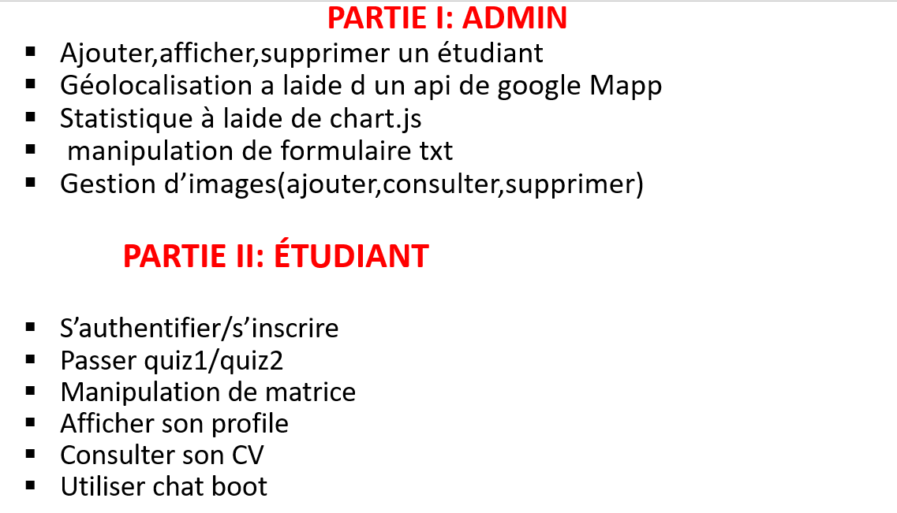

# 🎓 Projet Web – Gestion des Étudiants
> Réalisé par **Nour Hassan Abdillahi**

Ce projet complet a été réalisé dans le cadre de ma formation en développement web. Il permet la **gestion des étudiants** côté administrateur et la **consultation d’un espace étudiant**, avec des fonctionnalités avancées (quiz, chatbot, CV, carte…).

---

## 📽️ Démonstrations vidéos

- 🔧 [Code – Partie 2](partie2-code.mp4)
- 🖥️ [Résultat final](partie-resultat.mp4)

---

## 🗺️ Plan global du projet

---

## 👨‍💼 Partie Administrateur

- 📋 Ajouter / Supprimer un étudiant
- 📍 Géolocalisation des étudiants (Google Maps API)
- 📊 Statistiques via Chart.js
- 📁 Manipulation de fichiers texte (formulaire)
- 🖼️ Gestion des images (ajouter, consulter, supprimer)

## 👨‍🎓 Partie Étudiant

- 🔐 Authentification / inscription
- 🧠 Quiz dynamiques (quiz1 et quiz2)
- 🧮 Matrices / Calculs
- 📄 Affichage du profil
- 📎 CV numérique
- 🤖 Chatbot interactif

---

## 🛠️ Technologies utilisées

| Frontend        | Backend | Données      |
|-----------------|---------|--------------|
| HTML / CSS / JS | PHP     | MySQL        |
| Bootstrap       |         |              |
| Chart.js        |         |              |
| Google Maps API |         |              |

---

## 🧠 Objectifs pédagogiques

- Savoir développer une application PHP complète (front + back)
- Gérer plusieurs interfaces utilisateurs
- Travailler avec des fichiers, des API et des bases de données
- Créer des interfaces interactives avec JavaScript

---

## 📎 Auteur

**Nour Hassan Abdillahi**  
📍 Master RSI 2023-2025
